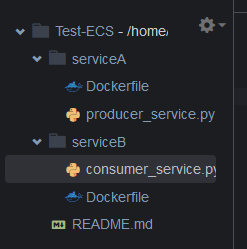
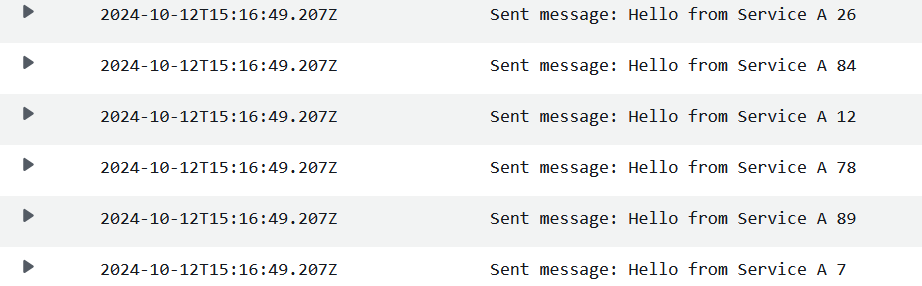
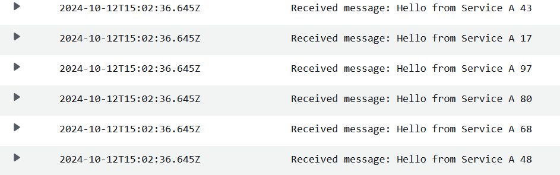
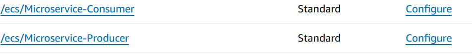

# Build a Microservice Architecture

**Services used**: ECS, SQS, CloudWatch, Cloud9

## 1. Create the Service Code

We are going to be using 2 services, **ServiceA** and **ServiceB**. Below is the necessary code.

### Service A:
Generates random messages and sends them to SQS every 5 seconds.

```python
# producer_service.py
import boto3
import time
import random

sqs = boto3.client('sqs', region_name='us-east-1')
queue_url = 'https://sqs.us-east-1.amazonaws.com/YOUR_ACCOUNT_ID/your-queue-name'

def send_message():
    message = f"Hello from Service A {random.randint(1, 100)}"
    sqs.send_message(QueueUrl=queue_url, MessageBody=message)
    print(f"Sent message: {message}")

if __name__ == "__main__":
    while True:
        send_message()
        time.sleep(5)  # Produce a message every 5 seconds
```

### Service B:
Polls messages from the SQS queue every 2 seconds and deletes them from the queue.

```python
# consumer_service.py
import boto3
import time

sqs = boto3.client('sqs', region_name='us-east-1')
queue_url = 'https://sqs.us-east-1.amazonaws.com/YOUR_ACCOUNT_ID/your-queue-name'

def receive_messages():
    response = sqs.receive_message(
        QueueUrl=queue_url,
        MaxNumberOfMessages=1,
        WaitTimeSeconds=10,
    )

    messages = response.get('Messages', [])
    if messages:
        for message in messages:
            print(f"Received message: {message['Body']}")
            sqs.delete_message(QueueUrl=queue_url, ReceiptHandle=message['ReceiptHandle'])

if __name__ == "__main__":
    while True:
        receive_messages()
        time.sleep(2)  # Poll the queue every 2 seconds
```

## 2. Create Docker Files Using Cloud9 IDE

In Cloud9, create a new environment and make two folders for each service: **ServiceA** and **ServiceB**.

Add the service files to each folder, and then create a `Dockerfile` in each.



### Dockerfile for Service A

```dockerfile
# Use a lightweight Python image
FROM python:3.8-slim

# Copy your code to the container
COPY producer_service.py /app/producer_service.py

# Install dependencies
RUN pip install boto3

# Set the command to run the service
CMD ["python", "/app/producer_service.py"]
```

### Dockerfile for Service B

```dockerfile
# Use a lightweight Python image
FROM python:3.8-slim

# Install dependencies
RUN pip install boto3

# Copy your code to the container
COPY consumer_service.py /app/consumer_service.py

# Set the command to run the service
CMD ["python", "/app/consumer_service.py"]
```

Run the following commands to build the images:

```bash
cd serviceA
docker build -t service-a-producer .

cd serviceB
docker build -t service-b-consumer .
```

**Authenticate the Docker client to the Amazon ECR registry to push the image:**

```bash
aws ecr get-login-password --region us-east-1 | docker login --username AWS --password-stdin 139406489149.dkr.ecr.us-east-1.amazonaws.com
```

Check the created Docker images:

```bash
docker images
```

Tag your images:

```bash
docker tag service-a-producer:latest 139406489149.dkr.ecr.us-east-1.amazonaws.com/service-a-producer:latest
docker tag service-b-consumer:latest 139406489149.dkr.ecr.us-east-1.amazonaws.com/service-b-consumer:latest
```

Push the images to ECR:

```bash
docker push 139406489149.dkr.ecr.us-east-1.amazonaws.com/service-a-producer:latest
docker push 139406489149.dkr.ecr.us-east-1.amazonaws.com/service-b-consumer:latest
```

## 3. Create a Cluster, Task, and Task Definition in ECS

1. Go to the **ECS Console** and create a new cluster called `Microservices-Cluster`.
   - Select **Fargate**.

2. Create a task for Service A:
   - Select **Service** as the application type.
   - Create a **Task Definition** with Fargate as the launch type.
   - Set up roles, network mode, and logging with CloudWatch.
   - Add environment variables:
     - Key: `QUEUE_URL`
     - Value: The SQS queue URL for your service.
   - Repeat for **Service B**.

3. Run tasks for both services and monitor logs in CloudWatch.

### Possible Issues:

- **Failed Task Creation**: Ensure the SQS URL is correct in the Python code.

- **Error faced**: 
  ```bash
  botocore.errorfactory.InvalidAddress: An error occurred (InvalidAddress) when calling the SendMessage operation: The address https://sqs.us-east-1.amazonaws.com/ is not valid for this endpoint.
  ```
  **Resolution**: Enter the correct SQS queue address in the Python code.

## Monitoring CloudWatch Logs

- **Service A (Producer)** logs messages sent:
  
  

- **Service B (Consumer)** logs messages received:

  

---

**Note**: You can view the logs by selecting each task from your cluster and checking the logs section.


